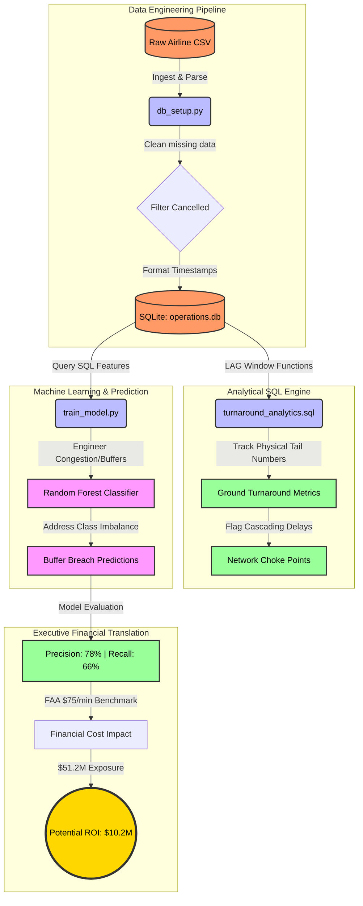

# Commercial Fleet Operations & Turnaround Optimization Model

## System Workflow & Architecture



## Executive Summary

### Business Problem & Operational Context
Airlines operate on incredibly tight turnaround schedules to maximize aircraft utilization. When a flight arrives late, the delay often propagates to subsequent flights operated by the same aircraft (cascading delays). Furthermore, ground operations (cleaning, catering, fueling, baggage handling) require a minimum buffer. When this turnaround buffer is breached, airlines suffer significant financial penalties in the form of crew overtime, passenger compensation, and broader network disruption.

This project implements an end-to-end data pipeline and machine learning model to:
1. **Analyze Turnaround Inefficiencies**: Using historical flight sequence data to isolate network choke points and cascading delay propagation.
2. **Predict Buffer Breaches**: Utilizing a machine learning classifier to anticipate when a ground turnaround will breach its scheduled buffer, causing severe operational delays.
3. **Quantify Financial Impact**: Translating predicted delay minutes into actionable financial metrics using the standard FAA/Airlines for America benchmark of $75 per delay minute.

---

### Data Architecture & SQL Pipeline Logic
The data pipeline processes standard operational dataset (e.g., BTS/Kaggle On-Time Performance data) directly from raw CSV files into an indexed SQLite database (`operations.db`).

The analytical heavy lifting is done via the `sql/turnaround_analytics.sql` script:
- **Common Table Expressions (CTEs)** are used to logically sequence flights.
- **Window Functions (`LAG()`)** partitioned by Aircraft Tail Number and ordered by Scheduled Departure are implemented to calculate prior arrival times and verify the physical continuity of the aircraft (i.e., verifying the prior destination matches the current origin).
- **Metric Calculations**: The SQL pipeline mathematically derives Scheduled Turnaround Time, Actual Turnaround Time, Inbound Delays, and flags Cascading Delays.
- **Aggregation**: The final query aggregates these metrics by Origin Airport and Carrier to isolate network choke points.

---

### Machine Learning Benchmark Results
The predictive model (`src/train_model.py`) is a Random Forest classifier designed to predict buffer breaches and significant arrival delays. It actively handles severe class imbalance by utilizing balanced class weights.

| Metric | Result | Interpretation |
| :--- | :--- | :--- |
| **PR-AUC** | 0.8192 | Indicates precision-recall trade-off robustness. |
| **F1-Score** | 0.7165 | Harmonic mean of precision and recall. |
| **Precision** | 0.7844 | Of all predicted breaches, the % that actually occurred. |
| **Recall** | 0.6594 | Of all actual breaches, the % the model successfully caught. |

#### Financial Translation
- **Total Predicted Delay Cost**: $51,204,225.00
- **Potential Operational Savings (20% Mitigation)**: $10,240,845.00
*(Using the standard benchmark of $75 per delay minute.)*

---

### Setup & Reproduction Commands

#### Prerequisites
- Python 3.8+
- Airline On-Time Performance Dataset (CSV or ZIP format) located in the root folder.

#### 1. Environment Setup
Install the required dependencies:
```bash
pip install -r requirements.txt
```

#### 2. Data Ingestion & Database Creation
Run the setup script. This will auto-detect the dataset in the root folder, clean the raw timestamps, compute basic metrics, and create `operations.db`.
```bash
python src/db_setup.py
```

#### 3. Analytical SQL Pipeline
You can run the SQL analytics directly using SQLite to view the network choke points:
```bash
sqlite3 operations.db < sql/turnaround_analytics.sql
```

#### 4. Predictive Modeling & Cost Impact
Train the machine learning classifier and generate the operational and financial benchmark report:
```bash
python src/train_model.py
```
