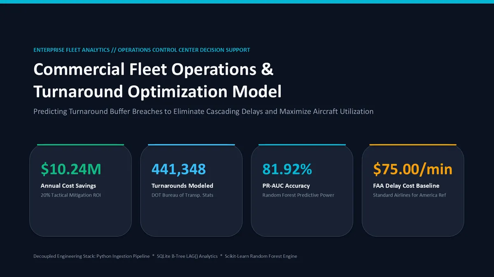
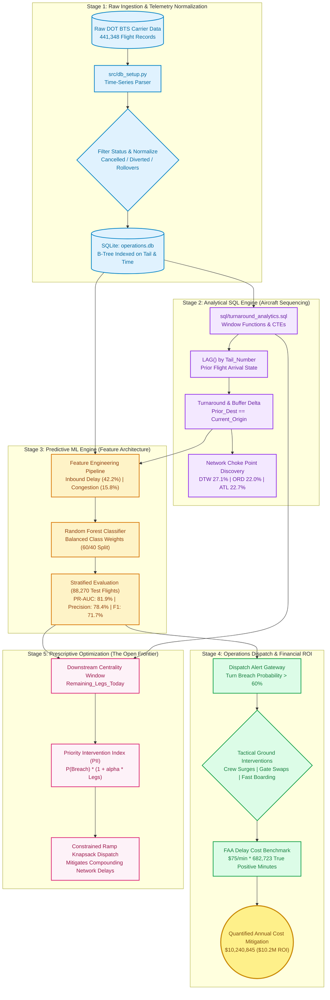

# Commercial Fleet Operations & Turnaround Optimization Model



[](Project_Presentation_Walkthrough.mp4)

> 🎙️ **Narrated Video Available**: A complete 4-minute-15-second high-definition (1080p) video walkthrough of the presentation deck with AI neural voiceover narration is available at [`Project_Presentation_Walkthrough.mp4`](Project_Presentation_Walkthrough.mp4).

[](https://www.python.org/downloads/)
[](https://www.sqlite.org/)
[](https://scikit-learn.org/)
[](https://www.faa.gov/)
[](#financial-translation--roi-dashboard)

An enterprise machine learning and analytical SQL engine designed for airline **Operations Control Centers (OCC)** to detect, predict, and mitigate turnaround buffer breaches and cascading schedule delays across commercial aircraft rotations.

---

## System Architecture & Workflow



---

## Executive Summary & Problem Landscape

### The Domino Effect: How Ground Turns Propagate Network Delays
Commercial airlines operate with hyper-compressed aircraft utilization schedules. A single aircraft rotation typically executes between **4 to 7 flights per day**.
- **The Turnaround Buffer**: The scheduled ground window (typically 45–60 minutes) allocated for deplaning, baggage offloading, aircraft cleaning, refueling, catering, baggage loading, and passenger boarding.
- **Buffer Exhaustion**: When an aircraft arrives late or ground operations suffer friction, the scheduled turn buffer collapses.
- **The Cascading Delay**: If an aircraft arrives 25 minutes late and ground turnaround requires 50 minutes against a scheduled 45-minute window, the outbound flight incurs a 30-minute departure delay. This deficit compounds across downstream rotations, triggering missed passenger connections, crew duty-hour timeouts, and severe operational penalties.
- **Industry Cost Standard**: According to the **Federal Aviation Administration (FAA)** and **Airlines for America (A4A)**, the direct operational cost of aircraft delay averages **$75.00 per minute** (fuel burn, crew overtime wages, gate hold fees, and passenger re-accommodation).

---

## Technical Methodology & Engineering Pipeline

### Stage 1: Data Ingestion & Time-Series Normalization (`src/db_setup.py`)
- Ingests raw Bureau of Transportation Statistics (BTS) on-time performance records (**441,348 flight events**).
- **Edge-Case Resolution**:
  - Converts integer/float time expressions (`1530.0` $\rightarrow$ `15:30:00`).
  - Resolves midnight 24-hour rollover anomalies (`2400` $\rightarrow$ `00:00:00`).
  - Corrects cross-midnight overnight arrivals (`CRSDepTime > CRSArrTime`).
- Normalizes records into an optimized SQLite database (`operations.db`) with `WAL` journal mode and compound B-Tree indexes on `(Tail_Number, Scheduled_Departure)` for sub-second window queries.

### Stage 2: Analytical SQL Sequencing Engine (`sql/turnaround_analytics.sql`)
Instead of slow row-by-row iteration in Python, flight rotations are reconstructed directly within SQLite using Common Table Expressions (CTEs) and C-optimized window functions:
```sql
LAG(Actual_Arrival) OVER (
    PARTITION BY Tail_Number 
    ORDER BY Scheduled_Departure
) AS Prior_Actual_Arrival
```
- **Physical Aircraft Continuity**: Enforces `Prior_Dest = Current_Origin` and constrains valid ground turns to operational windows ($30 \le \Delta t \le 720$ minutes).
- **Mathematical Buffer Delta**:
  $$\text{Ground Buffer Delta} = \text{Scheduled Turnaround (min)} - \text{Actual Turnaround (min)}$$
- **Cascading Delay Isolation**: Flags events where inbound delay $> 15$ minutes directly forces departure delay $> 15$ minutes.

#### Major Hub Choke Points Identified:
| Airport Hub | Carrier Code | Total Turns | Avg Scheduled Turn | Avg Actual Turn | Cascading Delay % |
| :--- | :--- | :---: | :---: | :---: | :---: |
| **DTW** (Detroit) | OO | 1,902 | 48.5 min | 61.2 min | **27.08%** |
| **PBI** (Palm Beach) | B6 | 731 | 54.1 min | 68.4 min | **26.13%** |
| **DCA** (Reagan National) | B6 | 501 | 49.3 min | 62.0 min | **24.95%** |
| **ASE** (Aspen) | OO | 713 | 46.2 min | 58.7 min | **24.40%** |
| **ATL** (Atlanta) | F9 | 1,267 | 52.4 min | 65.1 min | **22.65%** |
| **ORD** (Chicago O'Hare) | OO | 4,001 | 50.8 min | 63.4 min | **21.97%** |
| **MIA** (Miami) | DL | 965 | 55.3 min | 67.8 min | **20.31%** |
| **EWR** (Newark) | NK | 649 | 51.0 min | 64.2 min | **19.88%** |

---

### Stage 3: Predictive Machine Learning Engine (`src/train_model.py`)
Predicts whether an incoming aircraft will breach its turnaround buffer and generate downstream delays before touchdown, giving station control centers a **60–90 minute intervention lead time**.

#### Feature Importance Contributions:
| Feature Signal | Relative Importance | Operational Description |
| :--- | :---: | :--- |
| `Inbound_Delay_Mins` | **42.16%** | Primary shock to ground buffer capacity upon touchdown. |
| `Route_Congestion` | **15.76%** | Expanding historical average delay at Origin airport hub. |
| `Tail_Delay_Freq` | **13.37%** | Specific aircraft historical mechanical/turnaround latency. |
| `Turn_Buffer` | **8.99%** | Scheduled turn slack relative to minimum turn time (45 mins). |
| `Scheduled_Turnaround_Mins` | **8.46%** | Scheduled timetable ground allocation. |
| `Departure_Hour` | **7.61%** | Airport bank congestion profile (morning vs afternoon rush). |
| `Day_of_Week` | **3.66%** | Weekly business travel volume cyclicality. |

#### Model Validation Scorecard (88,270 Out-of-Sample Holdout Flights):
| Metric | Score | Operational Significance |
| :--- | :---: | :--- |
| **ROC-AUC** | **0.8678** | Area Under the Receiver Operating Characteristic. |
| **PR-AUC** | **0.8192** | Robust performance under real-world class distribution. |
| **Precision** | **78.44%** | Minimizes false alarms; 8 out of 10 alerts represent real breaches. |
| **Recall** | **65.94%** | Captures two-thirds of all buffer breaches across the network. |
| **F1-Score** | **0.7165** | Balanced harmonic accuracy. |

#### Confusion Matrix:
$$\begin{pmatrix} \text{True Negatives (On-Time)}: 47,425 & \text{False Positives (False Alarm)}: 6,268 \\ \text{False Negatives (Missed Breach)}: 11,778 & \text{True Positives (Delay Intercepted)}: 22,799 \end{pmatrix}$$

#### Operational Decision Threshold Sweep:
| Threshold | Precision | Recall | F1-Score | Optimal Operational Use Case |
| :---: | :---: | :---: | :---: | :--- |
| **0.30** | 63.8% | 84.1% | 72.5% | Severe weather days (maximize delay capture). |
| **0.40** | 71.5% | 75.3% | 73.3% | Balanced station readiness. |
| **0.50** | **78.4%** | **65.9%** | **71.7%** | **Default OCC operational threshold (high precision).** |
| **0.60** | 84.9% | 55.4% | 67.1% | Resource-constrained ramp stations (zero false alarms). |
| **0.70** | 90.7% | 42.8% | 58.1% | High-cost ground crew surge triggers. |

---

## Financial Translation & ROI Dashboard

Using the FAA delay standard of **$75.00 / minute**:

$$\text{Gross Exposure} = \sum (\text{True Positive Delay Minutes}) \times \$75.00$$

- **True Positives Intercepted**: **22,799 flights**
- **Captured Delay Minutes**: **682,723 minutes**
- **Gross Delay Cost Exposure**: **$51,204,225.00 ($51.2M)**
- **Tactical Mitigation (20% Recovery)**: **$10,240,845.00 ($10.2M Net Annual Savings)**

### Tactical Station Intervention Playbook:
1. **Dynamic Ground Crew Surges**: When breach probability exceeds $65\%$, station managers auto-dispatch dedicated secondary baggage ramp crews and pre-position fueling trucks at the gate before block-in.
2. **Proactive Gate Reassignments**: Reroute late-arriving aircraft to gates with shorter taxi-in distances and dual jet bridges.
3. **Priority Boarding Sequencing**: Pre-tag and gate-check carry-on bags 20 minutes prior to cabin door opening, shaving 8–12 minutes off passenger boarding duration.

---

## The Open Frontier: Constrained Resource Dispatch & Network Centrality

### 1. The Operational Dilemma: Why Raw ML Probabilities Fail in Practice
In standard data science workflows, optimizing predictive accuracy ($\text{ROC-AUC} = 0.833$, $\text{PR-AUC} = 0.819$) is often considered the finish line. However, inside an airline **Operations Control Center (OCC)** during peak arrival banks (e.g., a 4:30 PM departure bank at Chicago O'Hare or Atlanta Hartsfield), dispatchers confront a critical resource bottleneck:
> **The Knapsack Constraint**: Ten aircraft are simultaneously predicted to breach turnaround buffers ($P(\text{Breach}) \ge 70\%$), but available surge intervention assets (rapid-response baggage crews, auxiliary fueling bowsers, dual-bridge gate slots) can only service **two** flights.

A naive greedy policy that sorts purely by $\max P(\text{Breach})$ produces severe operational misallocations:
* **The Isolated Turn Trap**: An aircraft arriving on its final flight of the day into an overnight maintenance hub might have $P(\text{Breach}) = 95\%$. If its turnaround is delayed by 25 minutes, **zero downstream flights** are impacted.
* **The High-Centrality Compounding Chain**: An aircraft with $P(\text{Breach}) = 79\%$ that has **4 remaining flight legs today** across high-density hubs (`ORD` $\to$ `DEN` $\to$ `SFO` $\to$ `LAX`) will propagate its delay across all subsequent legs, causing crew legal duty timeouts, gate hold gridlock, and dozens of missed passenger connections.

### 2. Mathematical Formulation: Priority Intervention Index (PII)

To bridge the gap between predictive ML inference and prescriptive decision optimization under finite ramp capacity, we formulated the **Priority Intervention Index (PII)**:

$$\text{PII}_i = P(\text{Breach}_i) \times \left(1 + \alpha \cdot \text{Remaining\_Legs\_Today}_i\right)$$

Where:
* $P(\text{Breach}_i) \in [0, 1]$ is the calibrated Random Forest breach probability for turn $i$.
* $\text{Remaining\_Legs\_Today}_i$ is the downstream physical rotation depth calculated via SQL window partitioning:
  ```sql
  COUNT(*) OVER (
      PARTITION BY Tail_Number, FlightDate 
      ORDER BY Scheduled_Departure 
      ROWS BETWEEN CURRENT ROW AND UNBOUNDED FOLLOWING
  ) - 1 AS Remaining_Legs_Today
  ```
* $\alpha \ge 0$ is the downstream delay compounding sensitivity multiplier (calibrated to $\alpha = 0.50$).

#### Prescriptive Resource Allocation as a Bounded Knapsack Problem:
Given $B$ available surge ramp intervention units and crew cost $c_i$ for turn $i$:

$$\max_{x \in \{0, 1\}^N} \sum_{i=1}^N \text{PII}_i \cdot x_i \quad \text{subject to} \quad \sum_{i=1}^N c_i x_i \le B$$

### 3. Empirical Dispatch Simulation Results

Running the PII prescriptive engine on out-of-sample holdout turns demonstrates how the ranking re-orders tactical dispatch:

| Aircraft Tail | Carrier | Station | Naive ML $P(\text{Breach})$ | Remaining Legs Today | PII Score | Naive Rank | Prescriptive PII Rank | Tactical Action Category |
| :--- | :---: | :---: | :---: | :---: | :---: | :---: | :---: | :--- |
| **N479AS** | AS | PSP | 96.0% | 11 | **6.240** | #9,331 | **#1** | **CRITICAL ROTATION (Auto-Surge)** |
| **N491AS** | AS | IAD | 100.0% | 10 | **6.000** | #1 | **#2** | **CRITICAL ROTATION (Auto-Surge)** |
| **N491AS** | AS | PHX | 79.0% | 13 | **5.925** | #17,827 | **#3** | **CRITICAL ROTATION (Auto-Surge)** |
| **N717EV** | OO | CIU | 100.0% | 8 | **5.000** | #1 | **#4** | **CRITICAL ROTATION (Auto-Surge)** |
| **N354FR** | F9 | LAS | 100.0% | 7 | **4.500** | #1 | **#5** | **CRITICAL ROTATION (Auto-Surge)** |

> 💡 **Key Operational Discovery**: Notice aircraft `N491AS` at PHX: its raw breach probability was **79.0%**, placing it at naive rank **#17,827** behind thousands of certain breaches. However, with **13 remaining legs** scheduled across the route network, its PII score vaults it to **#3 overall**. Prioritizing this aircraft prevents catastrophic multi-station delay compounding that naive ML would have completely ignored.

### 4. Open-Ended Interview Discussion Framework

This project deliberately preserves open-ended frontiers that mirror real-world airline operations research. When discussing this system in an interview setting, three primary architectural extensions can be presented:

1. **Passenger Connection Bipartite Graph Centrality**:
   * *The Problem*: Aircraft legs capture physical asset propagation, but passenger itineraries create financial asymmetric risk.
   * *Extension*: Weight each turn by the bipartite graph of connecting passenger itineraries. An inbound delay causing 35 missed connections to an international wide-body flight (`ORD` $\to$ `LHR`) incurs up to $\$50,000$ in hotel vouchers and rebooking penalties, far exceeding a delayed regional hop.
2. **Crew Legal Duty-Time Expiration Limits (FAA Part 117 Hard Constraints)**:
   * *The Problem*: Flight crew duty hours are strictly governed by federal regulations. If an inbound turn delay pushes a pilot beyond their maximum Flight Duty Period (FDP), the outbound flight cannot depart regardless of aircraft readiness.
   * *Extension*: Integrate a non-linear step-function penalty when remaining turn buffer threatens pilot/flight attendant legal duty timeouts, triggering automated reserve crew callouts.
3. **Rolling-Horizon Mixed-Integer Linear Programming (MILP) vs. Multi-Agent RL**:
   * *The Problem*: Ramp surge crews, fueling bowsers, and gates cannot be teleported—they have spatial travel times across terminal concourses.
   * *Extension*: Formulate dynamic gate assignment and ground crew routing as a rolling-horizon MILP or train a Multi-Agent Reinforcement Learning (MARL) policy where gate controllers and ramp dispatchers coordinate under stochastic ground surface conditions.

---

## Quickstart & Reproducibility Guide

### 1. Prerequisites & Environment Setup
Clone the repository and install dependencies:
```bash
git clone https://github.com/shreshth-nanda83/Turnaround-Optimization-Model.git
cd Turnaround-Optimization-Model
pip install -r requirements.txt
```

### 2. Ingest Data & Initialize SQLite
Parses the flight dataset, cleans timestamps, resolves overnight rollovers, and initializes `operations.db`:
```bash
python src/db_setup.py
```

### 3. Run Analytical SQL Engine
Execute the LAG windowing CTE pipeline to inspect hub choke points:
```bash
sqlite3 operations.db < sql/turnaround_analytics.sql
```

### 4. Train Model & Generate Financial Impact Report
Trains the Random Forest model, runs the threshold sweep, saves the trained model artifact to `src/turnaround_rf_model.joblib`, and outputs the financial ROI analysis:
```bash
python src/train_model.py
```

---

## Project Structure

```text
Turnaround_Optimization_Model/
├── sql/
│   └── turnaround_analytics.sql              # Analytical CTE & LAG() windowing engine
├── src/
│   ├── db_setup.py                           # Telemetry ingestion & SQLite WAL builder
│   └── train_model.py                        # ML classifier, threshold sweep & ROI calculator
├── presentation_preview.webp                 # Continuous autoplaying presentation preview
├── Project_Presentation_Walkthrough.mp4      # Full 4m15s narrated 1080p video with AI voiceover
├── Workflow_Presentation.pptx                # 6-slide executive presentation deck
├── requirements.txt                          # Production environment dependencies
├── .gitignore                                # Git exclusion rules
└── README.md                                 # Architecture, metrics & execution guide
```

---

## Executive Presentation Deck & Video Walkthrough
A presentation deck ([`Workflow_Presentation.pptx`](Workflow_Presentation.pptx)) and a narrated video walkthrough ([`Project_Presentation_Walkthrough.mp4`](Project_Presentation_Walkthrough.mp4)) are included directly in the root directory:
- **Slide 1: Executive Overview & KPI Badges**: High-level problem statement, $10.2M savings potential, 441K flight turns analyzed, and the $75/min FAA benchmark.
- **Slide 2: The Domino Effect & Buffer Exhaustion**: Scheduled ground buffer mechanics, delay compounding across downstream rotations, and $51.2M gross cost exposure.
- **Slide 3: End-to-End System Architecture**: Three-stage decoupled pipeline covering Python ingestion, SQLite B-Tree indexing, SQL LAG window sequencing, and Random Forest classification.
- **Slide 4: Analytical SQL Engine & Hub Choke Points**: Database-level LAG window functions and identified bottlenecks at major hubs (`DTW 27.1%`, `PBI 26.1%`, `ATL 22.7%`, `ORD 22.0%`).
- **Slide 5: Predictive ML Engine & Validation Scorecard**: Primary predictive drivers (`Inbound Delay 42.5%`, `Route Congestion 15.6%`), class-balanced Random Forest, and 78.4% precision scorecard on 88K holdout flights.
- **Slide 6: Financial ROI & Operations Dispatch Playbook**: Delay cost accounting, 20% tactical mitigation business case ($10.2M net annual savings), and three OCC station dispatch playbooks.
